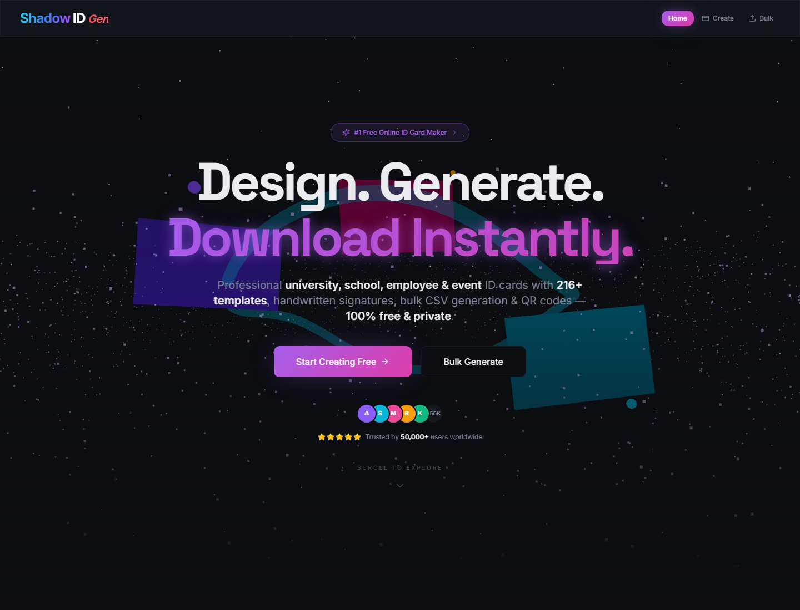
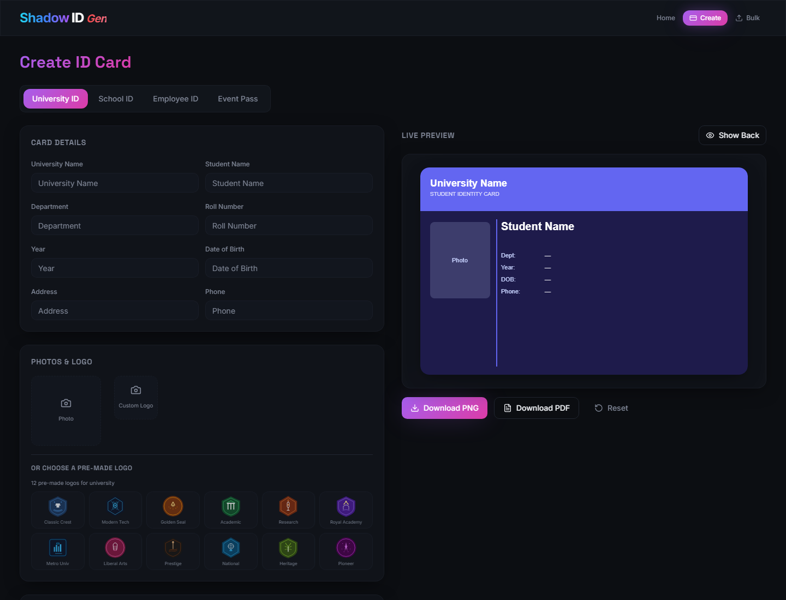
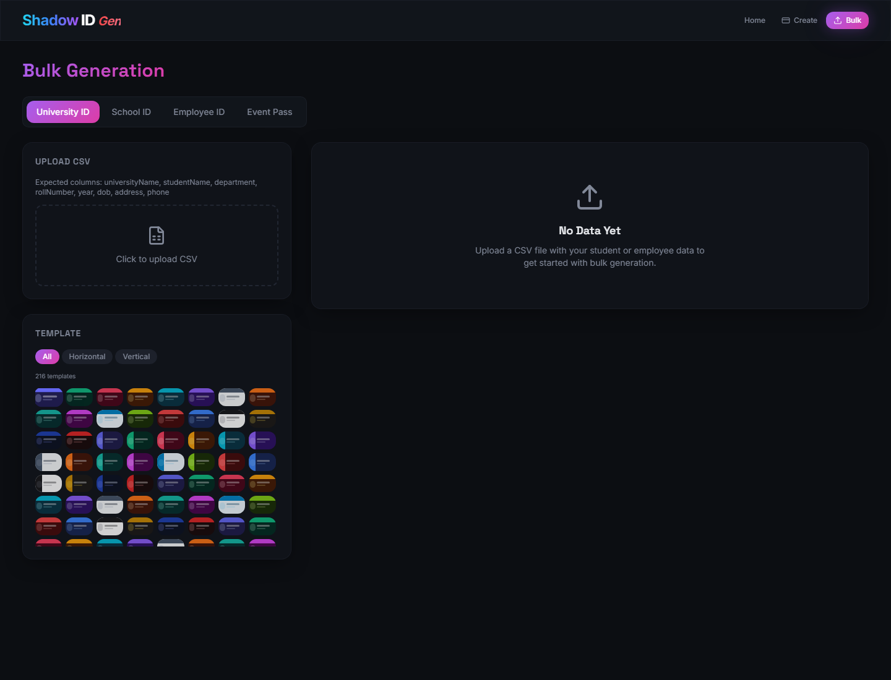

# Shadow ID Gen

<p align="center">
  
</p>

<p align="center">
  <a href="#quick-start"></a>
  <a href="#tech-stack"></a>
  <a href="#tech-stack"></a>
  <a href="#features"></a>
  <a href="#privacy"></a>
</p>

Shadow ID Gen is a modern, client-side ID card generator for universities, schools, companies, and events. It combines a polished animated landing page with a practical card builder, canvas-based previews, QR-backed card backs, PNG/PDF exports, and CSV bulk generation.

## Screenshots

| Home | Create | Bulk |
| --- | --- | --- |
|  |  |  |

## Features

- 216 generated card templates from 12 layouts and 18 color schemes.
- Four card modes: university, school, employee, and event pass.
- Live canvas preview with horizontal and vertical card layouts.
- Front and back card rendering with QR code support.
- PNG export for high-resolution image output.
- PDF export sized to the selected card orientation.
- CSV bulk import with validation and ZIP download for valid rows.
- Photo upload, custom logo upload, and pre-made logo gallery.
- 54 handwritten signature styles plus uploaded signature images.
- Animated landing page built with Framer Motion and React Three Fiber.
- Responsive navigation and mobile-friendly editor layouts.
- SEO metadata, Open Graph tags, JSON-LD, sitemap, and robots file.
- Browser-first privacy: no server upload is required for card creation.

## Demo Flow

1. Choose a card type from the landing page or open `/create`.
2. Fill in card details such as organization, name, ID, role, class, or event fields.
3. Upload a photo, choose a logo, and select a signature style.
4. Pick a template and preview the front or back side instantly.
5. Export a single card as PNG/PDF or upload CSV data on `/bulk` to download a ZIP.

## Quick Start

### Requirements

- Node.js 18 or newer
- npm 9 or newer

### Install

```bash
git clone https://github.com/your-username/shadow-id-gen.git
cd shadow-id-gen
npm install
```

### Run Locally

```bash
npm run dev
```

Open:

```text
http://localhost:8080
```

### Production Build

```bash
npm run build
npm run preview
```

## Scripts

| Command | Purpose |
| --- | --- |
| `npm run dev` | Start the Vite development server on port 8080. |
| `npm run build` | Create a production build in `dist/`. |
| `npm run build:dev` | Build with development mode settings. |
| `npm run preview` | Preview the production build locally. |
| `npm run lint` | Run ESLint across the project. |
| `npm run test` | Run Vitest once. |
| `npm run test:watch` | Run Vitest in watch mode. |

## CSV Bulk Guide

The bulk generator accepts a `.csv` file and maps columns by header name. If headers do not match exactly, it falls back to column order.

### University CSV

```csv
universityName,studentName,department,rollNumber,year,dob,address,phone
Northbridge University,Aarav Sharma,Computer Science,NU-2026-104,3rd Year,2004-05-14,Delhi,+91 98765 43210
```

### School CSV

```csv
schoolName,studentName,className,section,rollNumber,dob,guardianName,phone
Green Valley School,Anika Rao,10,A,22,2010-08-19,Rahul Rao,+91 98765 43210
```

### Employee CSV

```csv
companyName,employeeName,designation,department,employeeId,dob,phone,bloodGroup
Acme Labs,Neha Singh,Product Designer,Design,EMP-1092,1998-03-22,+91 98765 43210,O+
```

### Event CSV

```csv
eventName,attendeeName,role,date,validThrough
Design Summit 2026,Rohan Mehta,Speaker,2026-09-12,2026-09-14
```

## Tech Stack

- React 18 and TypeScript
- Vite 5
- Tailwind CSS and shadcn/ui primitives
- Framer Motion for UI animation
- Three.js, React Three Fiber, and Drei for 3D scenes
- QRCode for verification QR rendering
- jsPDF for PDF export
- JSZip for bulk ZIP downloads
- Vitest and Testing Library setup

## Project Structure

```text
.
├── public/                 # Static assets, robots.txt, sitemap.xml
├── src/
│   ├── components/         # Navbar, 3D scenes, ID card builder, UI primitives
│   ├── hooks/              # SEO and shared UI hooks
│   ├── lib/                # Utility helpers
│   ├── pages/              # Home, create, bulk, and not-found pages
│   ├── test/               # Vitest setup and catalog tests
│   ├── types/              # Card types, templates, colors, signatures
│   ├── App.tsx             # Router and providers
│   └── main.tsx            # React entry point
├── docs/screenshots/       # README screenshots
├── index.html              # SEO metadata and app shell
├── package.json            # Scripts and dependencies
└── vite.config.ts          # Vite configuration
```

## Privacy

Shadow ID Gen is designed as a browser-only tool. Photos, logos, signatures, CSV rows, card previews, and generated exports are processed locally in the user's browser. The app does not include a backend API.

## Deployment

This project can be deployed to any static hosting provider that supports Vite builds.

### Vercel

```bash
npm run build
```

Use these settings:

| Setting | Value |
| --- | --- |
| Framework | Vite |
| Build command | `npm run build` |
| Output directory | `dist` |

### Netlify

Use the same build command and publish directory:

```text
Build command: npm run build
Publish directory: dist
```

### GitHub Pages

For GitHub Pages, set the correct base path in `vite.config.ts` if deploying under a repository subpath, then publish the `dist/` output with your preferred Pages workflow.

## Pre-Push Checklist

Run this before pushing:

```bash
npm run lint
npm run test
npm run build
```

Recommended repository hygiene:

- Keep `node_modules/`, `dist/`, logs, local env files, and coverage output out of git.
- Commit `package-lock.json` so installs are reproducible.
- Update screenshots after major UI changes.
- Add a license file before publishing as an open-source project.

## Roadmap Ideas

- Export front and back cards together during bulk generation.
- Add CSV template download buttons for each card type.
- Add saved presets for repeated organizations.
- Add optional theme packs for institutions and events.

